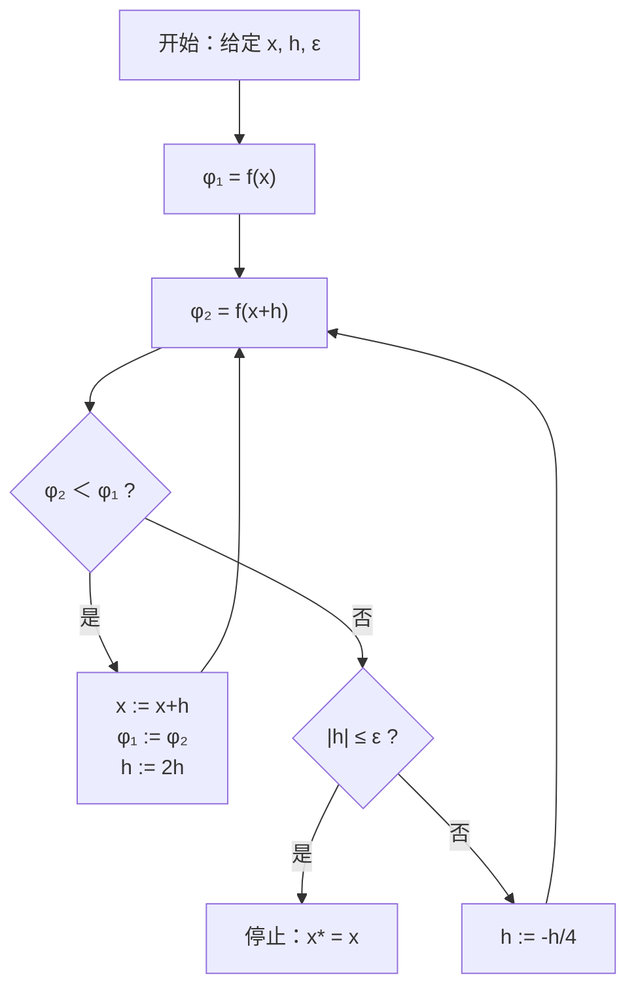
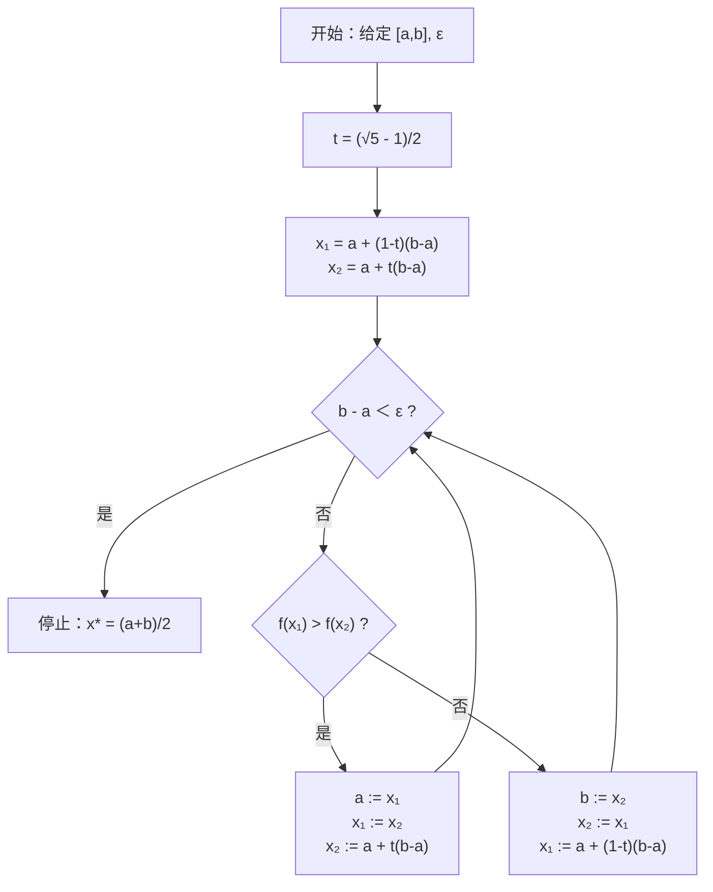
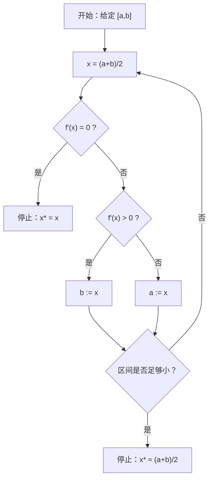
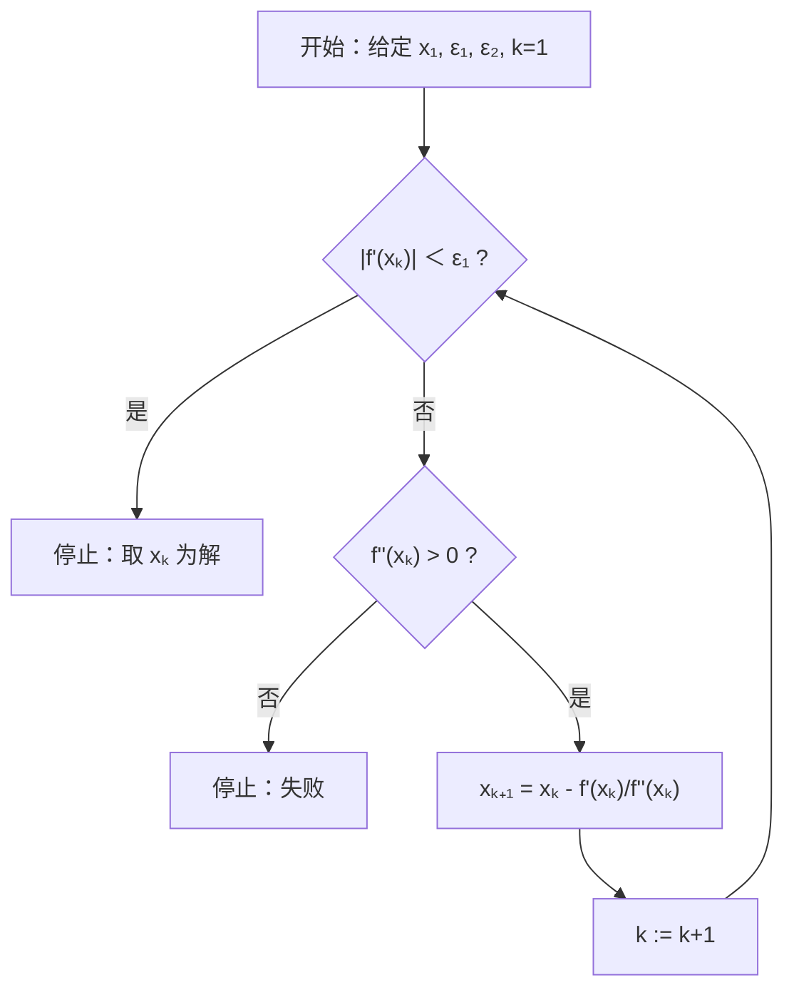
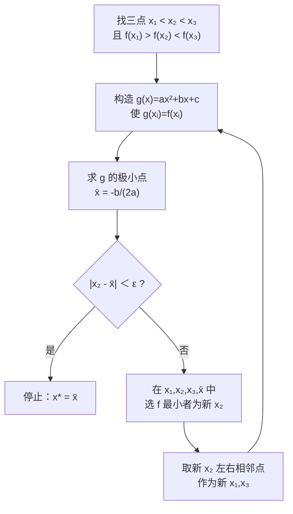
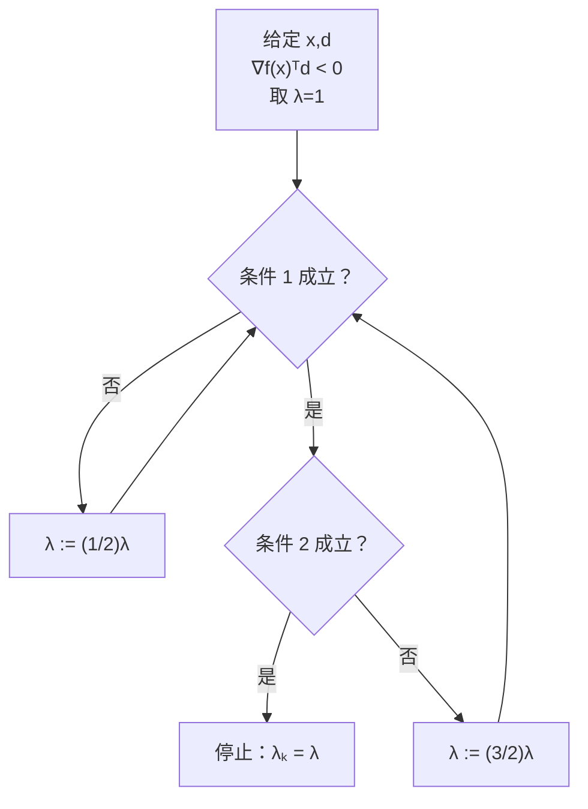

# 第四章常用的一维搜索方法学习笔记

本文整理第四章“常用的一维搜索方法”的基本问题、典型算法、公式推导、算法步骤和适用场景。

## 一、一维搜索的基本问题

在下降迭代算法中，已知当前点 $x^{(k)}$ 和搜索方向 $d^{(k)}$，一维搜索用于确定步长 $\lambda_k$：

$$
\min_{\lambda\in S} f\left(x^{(k)}+\lambda d^{(k)}\right)
=\min_{\lambda\in S}\varphi(\lambda)
$$

其中：

$$
\varphi(\lambda)=f\left(x^{(k)}+\lambda d^{(k)}\right)
$$

所以一维搜索本质上是把多元函数沿某个方向限制到一条直线上，转化为一元函数极小化问题。

常见搜索范围：

$$
S=(-\infty,+\infty),\qquad S=(0,+\infty),\qquad S=[a,b]
$$

若原问题为：

$$
\min_{a\le x\le b} f(x)
$$

可以定义：

$$
F(x)=
\begin{cases}
f(x), & a\le x\le b,\\
+\infty, & \text{otherwise}
\end{cases}
$$

则：

$$
\min_{a\le x\le b} f(x)
=
\min_{-\infty<x<+\infty}F(x)
$$

## 二、一维搜索方法分类

```text
一维搜索方法
├── 精确一维搜索方法
│   ├── 试探法
│   │   ├── 成功-失败法
│   │   ├── 0.618法
│   │   └── 二分法
│   └── 函数逼近法
│       ├── Newton法
│       └── 插值法
└── 非精确一维搜索方法
    ├── Goldstein法
    ├── Armijo法
    └── Wolfe-Powell法
```

对非连续函数适用的方法：

$$
\text{成功-失败法},\qquad 0.618\text{法}
$$

## 三、成功-失败法

成功-失败法也叫进退法，通常用于寻找搜索区间。

给定初始点 $x$，初始步长 $h$，精度 $\varepsilon$。先计算：

$$
\varphi_1=f(x),\qquad \varphi_2=f(x+h)
$$

若：

$$
\varphi_2<\varphi_1
$$

则搜索成功，更新：

$$
x:=x+h,\qquad \varphi_1:=\varphi_2,\qquad h:=2h
$$

若：

$$
\varphi_2\ge \varphi_1
$$

则搜索失败。若：

$$
|h|\le \varepsilon
$$

则停止，取：

$$
x^{\ast}=x
$$

否则：

$$
h:=-\frac{h}{4}
$$

继续试探。



特点：

$$
\text{优点：可以求搜索区间}
$$

$$
\text{缺点：效率低}
$$

注意：初始步长不能选得太小。

## 四、单峰函数

设 $f(x)$ 定义在 $[a,b]$ 上。若存在 $x^{\ast}\in[a,b]$，使 $x^{\ast}$ 是 $f$ 在 $[a,b]$ 上的最小点，并且对任意 $a\le x_1<x_2\le b$，满足：

若：

$$
x_2\le x^{\ast}
$$

则：

$$
f(x_1)>f(x_2)
$$

若：

$$
x_1\ge x^{\ast}
$$

则：

$$
f(x_1)<f(x_2)
$$

则称 $f(x)$ 为 $[a,b]$ 上的单峰函数。

在本章中，单峰函数可以理解为：

$$
\text{先下降，后上升，只有一个最小点}
$$

也就是“单谷函数”。

## 五、单峰函数缩区间定理

设 $f$ 在 $[a,b]$ 上是单峰函数，且：

$$
a\le x_1<x_2\le b
$$

则：

若：

$$
f(x_1)\ge f(x_2)
$$

则：

$$
x^{\ast}\in[x_1,b]
$$

即可以删去：

$$
[a,x_1]
$$

若：

$$
f(x_1)<f(x_2)
$$

则：

$$
x^{\ast}\in[a,x_2]
$$

即可以删去：

$$
[x_2,b]
$$

该定理是 $0.618$ 法缩短搜索区间的理论依据。

## 六、0.618 法

### 1. 缩减比推导

取两点：

$$
x_1<x_2
$$

要求对称：

$$
x_1-a=b-x_2
$$

设缩减比：

$$
t=\frac{\text{保留区间长度}}{\text{原区间长度}}
$$

若保留 $[a,x_2]$，则：

$$
t=\frac{x_2-a}{b-a}
$$

所以：

$$
x_2=a+t(b-a)
$$

为了让上一次计算过的点在下一次继续复用：

$$
x_1=a+t(x_2-a)
$$

结合对称条件：

$$
x_1-a=b-x_2
$$

可得：

$$
t^2+t-1=0
$$

舍去负根：

$$
t=\frac{\sqrt5-1}{2}\approx 0.618
$$

又因为：

$$
t^2=1-t
$$

所以：

$$
x_1=a+(1-t)(b-a)
$$

$$
x_2=a+t(b-a)
$$

### 2. 算法流程



特点：

$$
\text{优点：不用导数，每次只需新增一个函数值}
$$

$$
\text{缺点：收敛速度较慢}
$$

## 七、二分法

适用条件：

$$
f(x)\text{ 在 }[a,b]\text{ 上可微}
$$

且极小点满足：

$$
f'(x^{\ast})=0
$$

取中点：

$$
x=\frac{a+b}{2}
$$

若：

$$
f'(x)=0
$$

则：

$$
x=x^{\ast}
$$

若：

$$
f'(x)>0
$$

说明 $x$ 在上升段，极小点在左边：

$$
x^{\ast}<x
$$

保留：

$$
[a,x]
$$

若：

$$
f'(x)<0
$$

说明 $x$ 在下降段，极小点在右边：

$$
x^{\ast}>x
$$

保留：

$$
[x,b]
$$

误差估计：

$$
\left|x^{\ast}-\frac{a+b}{2}\right|
<
\frac{b-a}{2}
$$



特点：

$$
\text{优点：计算量较少，总能收敛到局部极小点}
$$

$$
\text{缺点：收敛速度较慢}
$$

## 八、Newton 法

对一元函数 $f(x)$ 在 $x_k$ 点作 Taylor 展开：

$$
f(x)
=
f(x_k)+f'(x_k)(x-x_k)
+\frac12 f''(x_k)(x-x_k)^2
+o((x-x_k)^2)
$$

取二次近似：

$$
g(x)=f(x_k)+f'(x_k)(x-x_k)
+\frac12 f''(x_k)(x-x_k)^2
$$

若：

$$
f''(x_k)>0
$$

则 $g(x)$ 开口向上，其驻点为极小点。

令：

$$
g'(x)=f'(x_k)+f''(x_k)(x-x_k)=0
$$

得：

$$
x=x_k-\frac{f'(x_k)}{f''(x_k)}
$$

Newton 法取该点为下一次迭代点：

$$
x_{k+1}
=
x_k-\frac{f'(x_k)}{f''(x_k)}
$$



特点：

$$
\text{收敛速度快，二阶收敛}
$$

缺点：

$$
\text{需要二阶导数，对初始点要求高，局部收敛}
$$

Newton 收敛定理：

若 $f(x)$ 存在连续三阶导数，且：

$$
f'(x^{\ast})=0,\qquad f''(x^{\ast})\ne 0
$$

初始点 $x_1$ 充分接近 $x^{\ast}$，则 Newton 法产生的序列 $\{x_k\}$ 二阶收敛于 $x^{\ast}$。

二阶收敛可理解为误差满足：

$$
|x_{k+1}-x^{\ast}|
\le C|x_k-x^{\ast}|^2
$$

## 九、三点二次插值法

先找三点：

$$
x_1<x_2<x_3
$$

满足：

$$
f(x_1)>f(x_2)<f(x_3)
$$

即“两头大，中间小”。

设二次插值函数：

$$
g(x)=ax^2+bx+c
$$

使：

$$
g(x_i)=f(x_i),\quad i=1,2,3
$$

由三点插值条件可直接解出 $a,b$。记分母

$$
D=(x_1-x_2)(x_2-x_3)(x_3-x_1).
$$

则

$$
a=
-\frac{
(x_1-x_2)f(x_3)+(x_2-x_3)f(x_1)+(x_3-x_1)f(x_2)
}{
D
}
$$

$$
b=
\frac{
(x_1^2-x_2^2)f(x_3)+(x_2^2-x_3^2)f(x_1)+(x_3^2-x_1^2)f(x_2)
}{
D
}
$$

若：

$$
a>0
$$

则 $g(x)$ 的极小点为：

$$
\bar{x}=-\frac{b}{2a}
$$

若：

$$
|x_2-\bar{x}|<\varepsilon
$$

则停止，取：

$$
x^{\ast}=\bar{x}
$$

否则在四个点：

$$
x_1,\quad x_2,\quad x_3,\quad \bar{x}
$$

中选取使 $f(x)$ 最小的点作为新的 $x_2$，并取其左右相邻点作为新的 $x_1,x_3$，继续迭代。



注意：

$$
\text{算法的终止条件可能无法保证算法一定收敛}
$$

若算法收敛，在一定条件下是超线性收敛，收敛阶约为：

$$
1.3
$$

## 十、三次插值法

三次插值法也用于一维搜索。它比三点二次插值法多使用端点导数信息。

已知：

$$
f(a),\quad f(b),\quad f'(a),\quad f'(b)
$$

构造三次多项式 $P(x)$ 近似 $f(x)$，再用 $P(x)$ 的极小点作为 $f(x)$ 极小点的近似值。

设：

$$
P(x)=\alpha(x-a)^3+\beta(x-a)^2+\gamma(x-a)+\delta
$$

并令其满足：

$$
P(a)=f(a),\quad P(b)=f(b)
$$

$$
P'(a)=f'(a),\quad P'(b)=f'(b)
$$

因为三次多项式有四个系数，以上四个条件正好可以确定 $P(x)$。

教材中常用记号为：

$$
v=f'(a),\qquad u=f'(b)
$$

$$
s=3\frac{f(b)-f(a)}{b-a}
$$

$$
z=s-u-v
$$

$$
w=\sqrt{z^2-uv}
$$

若：

$$
uv=f'(a)f'(b)<0
$$

说明两端导数异号，区间内存在驻点。此时三次插值法给出的近似极小点为：

$$
\bar x
=
a-
\frac{(b-a)v}{z-w\operatorname{sign}(v)-v}
$$

其中：

$$
\operatorname{sign}(v)=
\begin{cases}
1, & v>0,\\
-1, & v<0.
\end{cases}
$$

计算步骤可记为：

1. 给定初始点 $a$、步长 $h$、精度 $\varepsilon$；
2. 计算 $v=f'(a)$，若 $|v|<\varepsilon$，停止，取 $x^{\ast}=a$；
3. 根据 $v$ 的符号确定搜索方向：若 $v<0$，向右搜索；若 $v>0$，向左搜索；
4. 取 $b=a+h$，计算 $u=f'(b)$；
5. 若 $|u|<\varepsilon$，停止，取 $x^{\ast}=b$；
6. 若 $uv<0$，用上面的三次插值公式求 $\bar x$；
7. 用 $\bar x$ 更新当前点，继续检查导数是否满足精度要求。

与三点二次插值法的区别：

$$
\text{三点二次插值法使用 } f(x_1),f(x_2),f(x_3)
$$

$$
\text{三次插值法使用 } f(a),f(b),f'(a),f'(b)
$$

因此，三次插值法通常收敛更快，但需要计算导数，公式也更复杂。

### 3. 三次插值法退化为二次插值法的条件

在三次插值法中，

$$
P(x)=\alpha(x-a)^3+\beta(x-a)^2+\gamma(x-a)+\delta
$$

若：

$$
\alpha=0
$$

则三次多项式退化为二次多项式。

记：

$$
d=\frac{f(b)-f(a)}{b-a}
$$

由插值条件可得：

$$
\alpha(b-a)^2=u+v-2d
$$

所以：

$$
\alpha=0
\Longleftrightarrow
u+v-2d=0
$$

又因为：

$$
s=3d,\qquad z=s-u-v
$$

当 $\alpha=0$ 时，

$$
d=\frac{u+v}{2}
$$

于是：

$$
z=3d-u-v
=3\cdot\frac{u+v}{2}-u-v
=\frac{u+v}{2}
$$

因此：

$$
u+v-2z=0
$$

这就是该结论的核心证明。

## 十一、非精确一维搜索

考虑：

$$
x^{(k+1)}=x^{(k)}+\lambda_k d^{(k)}
$$

要求：

$$
f(x^{(k)}+\lambda_k d^{(k)})<f(x^{(k)})
$$

并且：

$$
\lambda_k>0
$$

不能太小。

思想：

$$
\text{不要求每步精确最小，只要求下降充分、步长合适}
$$

这样单步计算速度快，虽然迭代步数可能增加，但整体效率可能更高。

## 十二、Goldstein 准则

前提：

$$
\nabla f(x)^Td<0
$$

即 $d$ 是下降方向。

求 $\lambda$，使：

$$
f(x+\lambda d)
\le
f(x)+\alpha\lambda\nabla f(x)^Td
$$

$$
f(x+\lambda d)
\ge
f(x)+(1-\alpha)\lambda\nabla f(x)^Td
$$

其中：

$$
\alpha\in(0,\frac12)
$$

实际常取：

$$
\alpha=0.1
$$

第一条保证充分下降；第二条防止步长太小。



记忆：

$$
1^\circ\text{ 不成立，缩小 }\lambda
$$

$$
2^\circ\text{ 不成立，放大 }\lambda
$$

Goldstein 更一般形式：

$$
f(x+\lambda d)
\le
f(x)+\alpha\lambda\nabla f(x)^Td
$$

$$
f(x+\lambda d)
\ge
f(x)+\sigma\lambda\nabla f(x)^Td
$$

其中：

$$
\sigma\in(\alpha,1)
$$

当：

$$
\sigma=1-\alpha
$$

时，退化为原 Goldstein 法。

## 十三、Armijo 准则

Armijo 法类似于 Goldstein 法。

求 $\lambda$，使：

$$
f(x+\lambda d)
\le
f(x)+\alpha\lambda\nabla f(x)^Td
$$

$$
f(x+\lambda d)
\ge
f(x)+\mu\alpha\lambda\nabla f(x)^Td
$$

其中：

$$
\alpha\in(0,\frac12),\qquad \mu\in(5,10)
$$

Armijo 法流程与 Goldstein 法类似，只是第二个判断条件不同。

## 十四、Wolfe-Powell 准则

Wolfe-Powell 法把 Goldstein 第二条改为对导数的要求。

求 $\lambda$，使：

$$
f(x+\lambda d)
\le
f(x)+\alpha\lambda\nabla f(x)^Td
$$

$$
\nabla f(x+\lambda d)^Td
\ge
\sigma\nabla f(x)^Td
$$

其中：

$$
\alpha\in(0,\frac12),\qquad \sigma\in(\alpha,1)
$$

实际常取：

$$
\alpha=0.1,\qquad \sigma=0.7
$$

含义：

$$
\text{函数值充分下降，且新点处方向导数不能仍然太负}
$$

也就是既要下降够，又要避免步长太小。

## 十五、总记忆

$$
\boxed{\text{成功-失败法：找搜索区间}}
$$

$$
\boxed{0.618\text{法：不用导数，稳定缩区间}}
$$

$$
\boxed{\text{二分法：用导数符号缩区间}}
$$

$$
\boxed{\text{Newton法：用二阶 Taylor 近似，速度快但局部收敛}}
$$

$$
\boxed{\text{插值法：用多项式近似原函数}}
$$

$$
\boxed{\text{非精确搜索：不求精确最小，只求合适步长}}
$$
